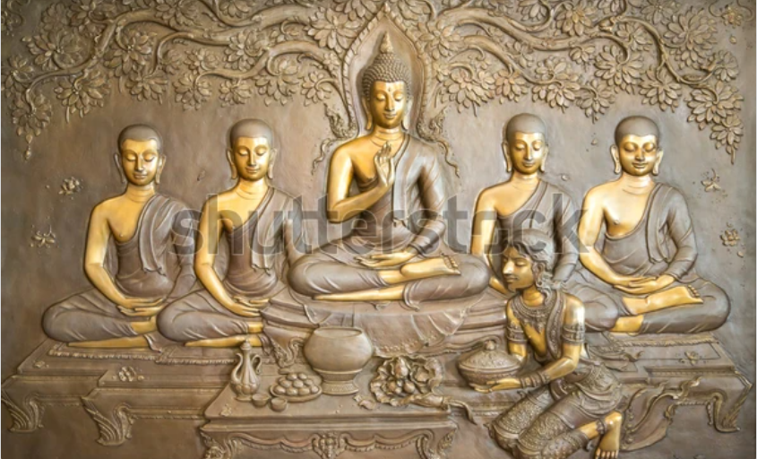

Acá el relato, luego:

| **Etapa / Periodo** | **Contexto histórico y características** | **Figuras / Textos clave** | **Transformaciones principales** |
|----------------------|------------------------------------------|-----------------------------|----------------------------------|
| **Orígenes védicos y preclásicos** (ca. s. VI–II a.C.) | Surge en el marco de las prácticas ascéticas (śramaṇa) y de la búsqueda de liberación (*moksha*). | *Upanishads*, *Bhagavad Gītā* | El yoga es una vía espiritual; no existen aún posturas físicas codificadas. |
| **Yoga clásico – Patañjali** (s. II a.C.–V d.C.) | Patañjali sistematiza la doctrina en los *Yoga Sūtras*. | Patañjali | Se establece el modelo dualista mente/cuerpo; el yoga es meditación y disciplina mental. |
| **Giro tántrico y hatha yoga** (s. V–XI) | Se introducen rituales, visualizaciones y la noción del cuerpo sutil (*chakras*). | Textos tántricos, *Haṭha Yoga Pradīpikā* | Revalorización del cuerpo como vía hacia lo divino. |
| **Período medieval y colonial temprano** (s. XII–XVIII) | Yoguis ascetas estigmatizados por la mirada colonial. | Nāth Yoguis | Marginalización del yoga corporal. |
| **Reformulación moderna – Vedanta y nacionalismo indio** (fin s. XIX–inicios s. XX) | Vivekananda lo presenta como filosofía universal y científica. | Swami Vivekananda, *Raja Yoga* (1896) | Desvinculación del ascetismo y expansión internacional. |
| **Yoga postural moderno** (1900–1950) | Se mezclan ejercicios de cultura física y espiritualidad. | Krishnamacharya, Iyengar, Jois | Foco en el cuerpo, la salud y la alineación. |
| **Globalización y cultura del bienestar** (1950–actualidad) | Popularización en EE. UU. y Europa, vinculada al New Age y al fitness. | Indra Devi, Swami Sivananda | Práctica global de bienestar y auto-optimización. |

